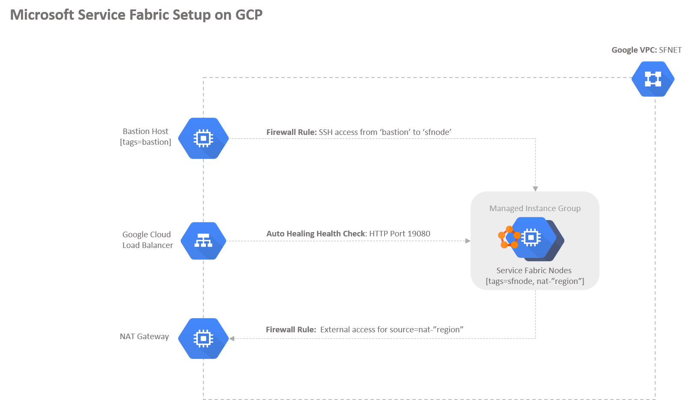

# Overview

This folder contains [terraform scripts](./main.tf) to launch a developement environment of the Microsoft's [Service Fabric](https://github.com/Microsoft/service-fabric) on Linux on the Google Cloud platform. This installation uses the Ubuntu script installation method described [here](https://docs.microsoft.com/en-us/azure/service-fabric/service-fabric-get-started-linux#installation-methods)

The diagram below illustrates the infrastructure that will get created:
 



## Running the sample

- Clone this repository
- Ensure you're in this (gcp/linux)
- Run a `terraform init`, `terraform plan` and `terraform apply` to create your service fabric environment. 

```
Outputs:

external_ip = <ip address>
```
- Hit `external_ip` that gets output to see your Service Fabric cluster:


- Run a `terraform destroy` to teardown your deployment


